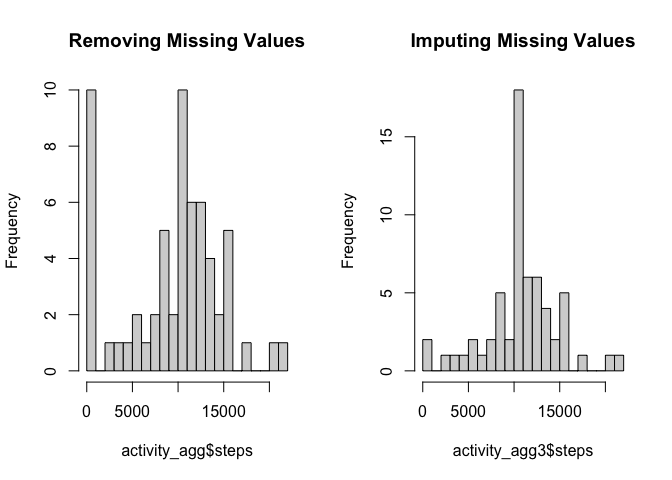

# Reproducible Research: Peer Assessment 1
Carlos Ignacio Patino  
June 10, 2015  


## Loading and preprocessing the data

The following code loads the unzipped data "activity.csv" and adjusts the `date` column in order to properly use date class.


```r
## Load activity data:
activity <- read.csv("activity.csv")

## Transform Date to proper class:
activity$date <- as.Date(activity$date, format="%Y-%m-%d")

## Check the structure of the data frame:
str(activity)
```

```
## 'data.frame':	17568 obs. of  3 variables:
##  $ steps   : int  NA NA NA NA NA NA NA NA NA NA ...
##  $ date    : Date, format: "2012-10-01" "2012-10-01" ...
##  $ interval: int  0 5 10 15 20 25 30 35 40 45 ...
```

The data has 2304 missing values for the `steps` column.

## What is mean total number of steps taken per day?

I now report a histogram of the total number of steps taken each day. Since each row represents the number of steps taken during each 5-minute interval in a given day, in order to get the total number of steps in a day it is necessary to make an additional transformation to the data. I load the `dplyr` package in order to do so. Then, I need to load the `ggplot2` package in order to use that system as the plotting one.


```r
library(dplyr)
activity_agg <- summarize(group_by(activity, date), steps=sum(steps, na.rm=T))
```


```r
library(ggplot2)
h <- ggplot(activity_agg, aes(x=steps))
h + geom_histogram() + labs(title="Histogram of the Total Number of Steps taken each Day") +
        theme_bw(base_family="Times", base_size=12)
```

 

Let´s now look at the mean and median total number of steps.


```r
mean_steps <- mean(activity_agg$steps, na.rm=T)
median_steps <- median(activity_agg$steps, na.rm=T)
```

The mean number of daily steps for this particular individual is 9354 and the median steps is 10395.

## What is the average daily activity pattern?

In order to look at the average daily activity patterns, I must first perform some transformations to the original data. In this case, we now want to plot the average number of steps (across all days) for each 5-minute interval.


```r
## No need to load again the dplyr package
activity_agg2 <- summarize(group_by(activity, interval), steps=mean(steps,na.rm=T))
```


```r
p <- ggplot(activity_agg2, aes(x=interval,y=steps))
p + geom_line() + labs(title="Average Number of Steps taken over every 5-minute Interval",
                       x="5-Minute Interval",y="Steps (Average across all days)") +
        theme_bw(base_family="Times", base_size=10)
```

 

The maximun number of average steps (across all days for each 5-minute interval) is 206.17 and corresponds to the 5-minute interval identified as 835.

## Imputing missing values


```r
missingvals <- sum(is.na(activity$steps))
```

The dataset contains a total of 2304 missing values.

Since there are days with all missing values, I use a very simple strategy for imputing missing values, and that is to use the mean value for the correspondent 5-minute interval. Therefore, I use the intermediate dataset (summary) generated in the previous step (mean steps for each 5-min int.). The following code merges the aggregated data (averaged steps by 5-minute interval) to the original data and then looks for missing data on column `steps` and replaces the values with the imputed ones (i.e. the averages for the corresponding 5-minute intervals).


```r
# first, rename "steps" in the auxiliary dataframe (with averages for each interval)
names(activity_agg2) <- c("interval", "steps_imp")

# Second, merge both tables by interval
activity2 <- merge(activity, activity_agg2, by="interval")

# Third, update original variable "steps"
for (i in 1:dim(activity2)[1]) {
        if (is.na(activity2[i,2])) {
                activity2[i,2] <- activity2[i,4]
        }
}
```

Now, I just create a new dataframe that is equal to the original one, but with the missing data filled in.


```r
activity_imp <- arrange(activity2[,c(1,2,3)],date)
```

Let´s now look at the new histogram, using the imputed dataset:


```r
activity_agg3 <- summarize(group_by(activity_imp, date), steps=sum(steps, na.rm=T))

h <- ggplot(activity_agg3, aes(x=steps))
h + geom_histogram() + labs(title="Histogram of the Total Number of Steps taken each Day (Imputed data)") +
        theme_bw(base_family="Times", base_size=12)
```

 

Let´s now look at the mean and median total number of steps (using the imputed dataset).


```r
mean_steps <- mean(activity_agg3$steps, na.rm=T)
median_steps <- median(activity_agg3$steps, na.rm=T)
```

The mean number of daily steps for this particular individual is 10766 and the median steps is 10766.

## Are there differences in activity patterns between weekdays and weekends?

First we need to create a new variable that tells us if the day on the date is a weekday or a weekend day.


```r
activity_imp$day <- weekdays(activity_imp$date)
activity_imp$day2 <- "weekday"
activity_imp$day2[activity_imp$day %in% c("Saturday","Sunday")] <- "weekend"
activity_imp$day2 <- as.factor(activity_imp$day2)
```

Then we aggregate (averaging) grouping by that factor we previously created and the interval, in order to compute the average number of steps by interval by type of day (across all corresponding days).


```r
## No need to load again the dplyr package
activity_agg4 <- summarize(group_by(activity_imp, day2, interval), steps=mean(steps,na.rm=T))
```

And then we can plot the comparisons, finding that apparently, there are differences in activity patterns between weekdays and weekends.


```r
p <- ggplot(activity_agg4, aes(x=interval,y=steps))
p + geom_line() + facet_grid(day2~.) +
        labs(title="Average Number of Steps taken over every 5-minute Interval",
             x="5-Minute Interval",y="Steps (Average across all days)") +
        theme_bw(base_family="Times", base_size=10)
```

 
